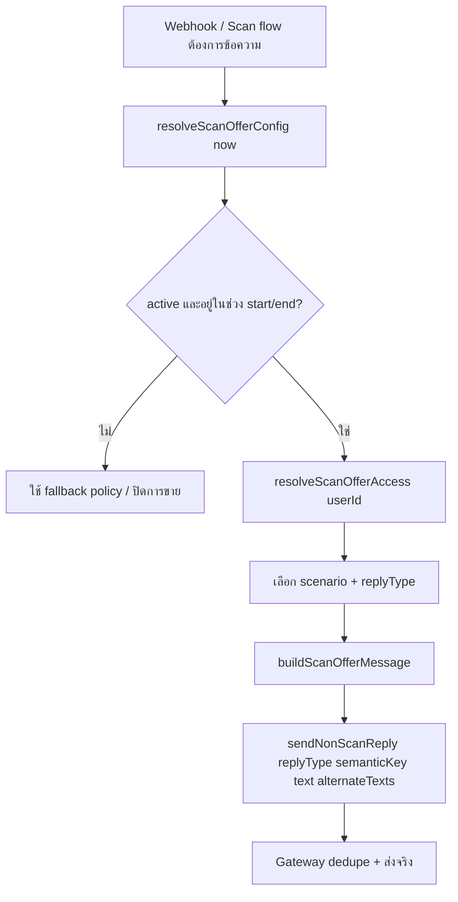

# Ener Scan — ระบบโปรโมชั่นสแกนแบบ config-driven (Technical spec)

**ขอบเขต:** ออกแบบการทำงาน + แยกความรับผิดชอบตามไฟล์  
**ไม่รวมในเฟสนี้:** แก้ scan engine, รื้อ rollout / report / wording layer

---

## PR1 (implemented) — config + access context

**Scope**

- **Config source:** `src/config/scanOffer.default.json` (หรือ override ด้วย env `SCAN_OFFER_CONFIG_PATH`)
- **Loader:** `src/services/scanOffer.loader.js` — `loadActiveScanOffer()`, `normalizeScanOffer()`, `isOfferActive()`, `resolveEffectiveScanOfferFromRaw()` (pure; ใช้ในเทสต์)
- **Access resolver:** `src/services/scanOfferAccess.resolver.js` — `decideScanGate()` (logic เดียวกับ `checkScanAccess`), `resolveScanOfferAccessContext()` → `ScanOfferAccessContext` (ไม่สร้างข้อความ)
- **Payment access:** `src/services/paymentAccess.service.js` — อ่านโปรจาก loader แทน `FREE_SCANS_LIMIT`; สัญญา `checkScanAccess()` เดิม; log `SCAN_OFFER_ACCESS_RESOLVED` (รวม `scenario`)

**Logs (PR1)**

- `SCAN_OFFER_CONFIG_LOADED` — `offerLabel`, `configVersion`, `freeQuotaPerDay`, `paidPriceThb`, `paidScanCount`, `paidWindowHours`, `usedFallback`, `reason` (เมื่อ fallback)
- `SCAN_OFFER_ACCESS_RESOLVED` — `userIdPrefix`, `scenario`, `offerLabel`, `configVersion`, `freeQuotaPerDay`, `paidPriceThb`, `paidScanCount`, `paidWindowHours`

**Access context contract (`ScanOfferAccessContext`)**

| Field | Role |
|-------|------|
| `scenario` | `free_available` \| `free_quota_low` \| `free_quota_exhausted` \| `paid_active` \| `paid_quota_exhausted` |
| `freeQuotaPerDay`, `freeUsedToday`, `freeRemainingToday` | ตัวเลขจาก offer + DB usage |
| `nextResetAt`, `nextResetLabel` | รีเซ็ตโควตฟรี (เที่ยงคืนท้องถิ่นเซิร์ฟเวอร์) |
| `paidPriceThb`, `paidScanCount`, `paidWindowHours` | จาก offer config |
| `offerLabel`, `offerConfigVersion` | metadata โปร |

**PR1 non-goals (ล็อก)**

- ไม่แตะ scan engine, rollout, report layer, admin UI

---

## PR2 (implemented) — template pool + copy + gateway

**Scope**

- **Templates:** `src/config/scanOffer.templates.th.js` — pools สำหรับ `free_quota_low`, `free_quota_exhausted`, `paid_quota_exhausted`, `offer_intro`, `approved_intro` (placeholder: `{price}`, `{count}`, `{hours}`, `{nextResetLabel}`, `{freeRemaining}`, `{offerLabel}`)
- **Reply type map:** `src/services/scanOffer.replyType.js` — `chooseScanOfferReplyType(accessContext, gate)`
- **Copy builder:** `src/services/scanOffer.copy.js` — `fillPlaceholders`, `buildScanOfferReply()`, `buildApprovedIntroReply()`; `semanticKey` = `scan_offer:<replyType>:v<configVersion>`
- **Payment gate reply:** `buildPaymentGateReply()` คืน `{ fallbackText, scanOffer: { replyType, semanticKey, primaryText, alternateTexts, scanOfferMeta }, decision }`
- **Webhook:** `buildPaymentRequiredText` (ไม่มี `userId`) ใช้ template จาก offer; `buildPaymentApprovedMessageLines` ใช้ `approved_intro` แทน persona `approvedIntroLine`
- **Scan flow:** `sendPaymentGateTextReply` — ถ้ามี `reply.scanOffer` ส่งผ่าน `sendNonScanReply` พร้อม `replyType` / `semanticKey` / `alternateTexts` / `scanOfferMeta` และข้าม persona paywall sequence
- **Gateway:** `sendNonScanReply` รับ optional `scanOfferMeta` → log **`SCAN_OFFER_REPLY_BUILT`** (phase `send`) เมื่อส่งสำเร็จ

**Extra field on access decision**

- `checkScanAccess()` คืนเพิ่ม `paidRemainingScans` (ตัวเลขจาก DB) เพื่อประกอบ context ตอนสร้าง copy

**PR2 non-goals**

- ไม่มี admin UI, ไม่เปลี่ยน rollout/report, ไม่เปลี่ยน scan engine, ไม่เปลี่ยน logic อนุมัติสลิป (แค่ข้อความหลังอนุมัติจาก template)

---

## 1) เป้าหมาย

1. **ปรับโปรหลังบ้านได้** โดยแก้จุดเดียวหรือน้อยจุด (config) ไม่ต้องไล่ hardcode หลายไฟล์  
2. **แยก logic กับ copy** — ตัดสินสิทธิ์/โควตา/เวลา reset อยู่ชั้น access; ข้อความสร้างจาก template + ค่าจาก config เท่านั้น  
3. **ใช้ non-scan reply gateway เดิม** (`sendNonScanReply` / `sendNonScanSequenceReply`) เพื่อกันข้อความซ้ำ (exact / semantic / alternate / suppression window)  
4. **เพิ่ม reply type** สำหรับโปร และมี **template pool ภาษาไทย** พร้อม placeholder  
5. **โทน:** สุภาพ ไม่ hard sell ไม่ customer service จ๋า ลดการพูดซ้ำ **ไม่มี emoji**

---

## 2) สถานะปัจจุบันใน repo (อ้างอิง)

| พื้นที่ | ไฟล์ / พฤติกรรม |
|---------|-------------------|
| สิทธิ์สแกน | `src/services/paymentAccess.service.js` — `checkScanAccess` ใช้ `loadActiveScanOffer().freeQuotaPerDay` + `decideScanGate()` (PR1) |
| ข้อความ paywall | `buildPaymentRequiredText` / `paywallText` ผ่าน `src/utils/webhookText.util.js` + `replyCopy.util.js` |
| Gateway กันซ้ำ | `src/services/nonScanReply.gateway.js` — exact + semantic (ตาม `semanticKey` + เนื้อหา) + `alternateTexts` เป็น variant |
| ล็อก | `NON_SCAN_REPLY_GATEWAY`, `[SCAN_ACCESS_DEBUG]` |

การออกแบบด้านล่าง **ไม่เปลี่ยน** สัญญา DB (`paid_until`, `paid_remaining_scans`, การนับสแกนต่อวัน) — แค่ให้ **ตัวเลขโปร** (โควตาฟรี/ราคา/จำนวนครั้ง/ชั่วโมง) มาจาก config แทน magic number ในหลายที่

---

## 3) โมเดล config (single source of truth สำหรับตัวเลขโปร)

### 3.1 ฟิลด์ที่ต้องรองรับ

| ฟิลด์ | ชนิด | คำอธิบาย |
|-------|------|----------|
| `active` | `boolean` | ปิดโปร = ใช้ fallback ปลอดภัย (เช่น ปิดการขายชั่วคราว แต่ยังนับสิทธิ์ตาม DB) — นิยามทางธุรกิจต้องชัด |
| `freeQuotaPerDay` | `number` | สิทธิ์ฟรีต่อวัน (ค่าเริ่มต้น **2**) |
| `paidPriceThb` | `number` | ราคา (บาท) สำหรับ copy + แสดง QR/สลิป (ค่าเริ่มต้น **49**) |
| `paidScanCount` | `number` | จำนวนครั้งที่ได้เมื่อชำระ (ค่าเริ่มต้น **5**) |
| `paidWindowHours` | `number` | ระยะเวลาใช้สิทธิ์หลังอนุมัติ (ชั่วโมง) — อธิบายใน copy; **การตัดสินว่า paid หมดอายุหรือยัง** ยังอิง `paid_until` ใน DB เป็นหลัก (ดู §5) |
| `startAt` | `string \| null` | ISO 8601 — โปรมีผลตั้งแต่ (optional) |
| `endAt` | `string \| null` | ISO 8601 — โปรหมดอายุ (optional) |
| `label` | `string \| null` | ชื่อภายใน / แสดงในแอดมิน (optional) |
| `configVersion` | `string` | เช่น `1` — ใส่ใน log เวลา debug |

**หมายเหตุ:** `paidWindowHours` ใช้ให้สอดคล้องกับการตั้ง `paid_until` ตอนอนุมัติการชำระ (ไม่ใช่แทนที่ DB) — ถ้า logic อนุมัติเดิมตั้ง window เป็น 24 ชม. อยู่แล้ว ค่าใน config ควร **match** เพื่อไม่ให้ copy กับความจริงคลาดเคลื่อน

### 3.2 ที่เก็บ config (แนะนำ)

**ตัวเลือก A (เร็ว, ops-friendly):** ไฟล์ JSON/YAML ใน repo หรือ path ที่โหลดตอนสตาร์ท  
- ไฟล์: `config/scanOffer.config.json` (หรือ `.cjs` ถ้าต้องการ comment)

**ตัวเลือก B (ปรับไม่ deploy):** ตาราง `app_settings` / KV ใน Supabase — อ่านแบบ cache TTL สั้น (เช่น 60s)

**แนะนำเฟสแรก:** A + env override เช่น `SCAN_OFFER_CONFIG_PATH` — ย้าย B ทีหลังได้โดยไม่เปลี่ยน access/copy interface

---

## 4) การแยกชั้น: Access vs Copy

### 4.1 Access layer (ไม่มีประโยคขาย / ไม่มีตัวเลขใน string)

**หน้าที่:** จาก `userId`, `now`, แถว `app_users`, การนับสแกนวันนี้, และ **ตัวเลขจาก offer config** → คืน **โครงสร้างผลลัพธ์** (plain data)

แนะนำ typedef (แนวคิด):

```ts
type ScanOfferAccessContext = {
  now: Date;
  offer: ResolvedOfferConfig; // active + ผ่าน start/end
  freeUsedToday: number;
  freeQuotaPerDay: number;
  freeRemainingToday: number;
  nextFreeResetAt: Date | null;      // instant ของการรีเซ็ต “วันใหม่” ตามเขตเวลาที่ใช้นับ (เช่น Asia/Bangkok)
  nextFreeResetLabel: string;        // สำหรับ placeholder — format ที่ copy layer กำหนด (ไม่ hardcode ใน access หลายที่)
  paidActive: boolean;
  paidRemainingScans: number;
  paidUntil: string | null;
  // สำหรับเลือก “reply scenario”
  scenario:
    | "free_ok"
    | "free_quota_low"      // เช่น เหลือ 1 ในขณะที่ quota > 1
    | "free_quota_exhausted"
    | "payment_required"    // ฟรีหมด และยังไม่มี paid ใช้งาน
    | "paid_quota_exhausted"
    | "offer_intro"         // แสดงข้อเสนอครั้งแรกหลังเข้าเงื่อนไข (นิยามชัดใน §6)
    | "approved_intro";    // หลังอนุมัติสลิป (ถ้าแยกจากข้อความเดิม)
};
```

**กฎ:** Access **ห้าม** ประกอบประโยคไทยที่มีตัวเลขโปร — มีแต่ตัวเลขและ enum

### 4.2 Copy layer

**หน้าที่:** รับ `ScanOfferAccessContext` + `ResolvedOfferConfig` → เลือก **reply type** → ดึง template จาก pool → `fillPlaceholders` → คืน `{ text, alternateTexts[] }` สำหรับ gateway

**กฎ anti-hardcode:**

- ตัวเลขทั้งหมดใน UI มาจาก `offer` หรือจากฟิลด์ใน context เท่านั้น  
- Template ใช้ placeholder เท่านั้น: `{price}`, `{count}`, `{hours}`, `{nextResetLabel}`, (อาจเพิ่ม `{freeRemaining}`, `{freeQuota}` ถ้าต้องการ)

---

## 5) ความสัมพันธ์กับ DB และ `checkScanAccess`

ปัจจุบัน `checkScanAccess` รวม logic ตัดสิน allowed/deny และคืนตัวเลขบางส่วน

**แนวทาง (ไม่รื้อ):**

1. แยกฟังก์ชันภายใน (หรือโมดูลใหม่) เช่น `resolveScanOfferAccess({ userId, now })` ที่:
   - โหลด `ResolvedOfferConfig`
   - เรียก logic เดิมของการนับฟรี/อ่าน paid จาก DB
   - ใช้ `freeQuotaPerDay` จาก config แทน `FREE_SCANS_LIMIT` constant
2. `checkScanAccess` กลายเป็น thin wrapper ที่คืน shape เดิม (+ optional ฟิลด์ใหม่สำหรับ copy) เพื่อไม่ให้ webhook/scan flow พัง

**ห้าม:** เปลี่ยนเงื่อนไข “เมื่อไรถึงจะสแกนได้” โดยไม่ตั้งใจ — แค่เปลี่ยนแหล่งตัวเลข quota

---

## 6) Reply types ใหม่ (ขั้นต่ำ)

| `replyType` | เมื่อใช้ |
|-------------|---------|
| `free_quota_exhausted` | ฟรีหมดตามวันแล้ว (ก่อนเข้า paywall หรือควบคู่กับ payment_required — ออกแบบให้ไม่ซ้ำความหมายกับข้อความชำระเงิน) |
| `free_quota_low` | ฟรียังใช้ได้แต่ใกล้หมด (เช่น เหลือ 1 ครั้ง ขณะที่ quota ≥ 2) |
| `paid_quota_exhausted` | มี paid แต่ `paid_remaining_scans === 0` หรือหมดอายุตาม window |
| `offer_intro` | แนะนำแพ็กเกจครั้งแรกเมื่อเข้าเงื่อนไข (เช่น หลังฟรีหมดครั้งแรก / ครั้งแรกที่เปิด paywall) — **นิยามธุรกิจต้องกำหนด** เพื่อไม่ชนกับข้อความ slip |
| `approved_intro` | หลังอนุมัติสลิป — บอกสิทธิ์ที่ได้ **จากตัวเลข config** |

**semanticKey แนะนำ:** ใช้คนละค่ากับ `replyType` ได้ถ้าต้องการแยก semantic window เช่น `semanticKey: "paywall_offer_v1"` ขณะที่ `replyType: "offer_intro"` เพื่อให้ dedupe ไม่รวมกับข้อความอื่นที่คล้ายกัน

---

## 7) Non-scan reply gateway — วิธีใช้ให้ได้ครบ 4 ชั้น

อ้างอิง `src/services/nonScanReply.gateway.js`:

| กลไก | พฤติกรรม |
|-------|----------|
| **Exact duplicate** | ข้อความเดิมทุกตัวอักษรกับ bubble ล่าสุดของ user → ไม่ส่ง |
| **Semantic duplicate** | `semanticKey` เดียวกัน + เนื้อหา normalize เหมือนกัน + ภายใน `NON_SCAN_SEMANTIC_WINDOW_MS` → ไม่ส่ง |
| **Alternate variant** | ส่ง `alternateTexts` — ลองทีละตัวจนกว่าจะไม่ชน exact/semantic |
| **Suppression window** | ปรับได้ด้วย env `NON_SCAN_SEMANTIC_WINDOW_MS` (และพฤติกรรม exact ที่เทียบกับข้อความล่าสุด) |

**แนวทางสำหรับโปร:**

- สร้าง **หลาย template ต่อ reply type** → ใส่เป็น `text` + `alternateTexts`  
- ถ้าต้องการ “ไม่พูดซ้ำง่าย” ระหว่างวัน: พิจารณา **หมุน template ตาม hash(userId+date)** ใน copy layer (ยังคงตัวเลขจาก config) — **ไม่** hardcode ใน webhook

---

## 8) Template pool ภาษาไทย

### 8.1 ที่เก็บ

แนะนำ: `src/utils/replyCopy/scanOffer.templates.th.js` (หรือใต้ `replyCopy.util.js` ถ้าต้องการไฟล์เดียว — แต่แยกไฟล์จะลดการแก้ชนกัน)

โครงสร้าง:

```js
export const SCAN_OFFER_TEMPLATES = {
  free_quota_exhausted: { pools: [ ["...", "..."], ... ] },
  free_quota_low: { ... },
  // ...
};
```

### 8.2 Placeholder

| Placeholder | แหล่งค่า |
|-------------|----------|
| `{price}` | `offer.paidPriceThb` |
| `{count}` | `offer.paidScanCount` |
| `{hours}` | `offer.paidWindowHours` |
| `{nextResetLabel}` | จาก access context (เช่น “พรุ่งนี้เวลา 00:01 น.” หรือรูปแบบที่ทีมกำหนด — **ฟังก์ชัน format อยู่ชั้นเดียว** เช่น `formatNextFreeResetForThai(nextFreeResetAt)`) |

ฟังก์ชัน `fillPlaceholders(template, vars)` — ไฟล์เช่น `src/utils/replyCopy/scanOffer.copy.js`

### 8.3 โทน (บังคับใน review checklist)

- สุภาพ กระชับ  
- ไม่กดซื้อเกินเหตุ  
- ไม่กล่าวแบบ call center (“ยินดีให้บริการค่ะ” หลายบรรทัด)  
- ไม่ emoji  
- หลีกเลี่ยงประโยคเดิมกับ template อื่นใน pool เดียวกัน

---

## 9) Flow (ลำดับการทำงาน)



**จุดที่ไม่แตะ:** engine สแกน, การสร้าง report payload, rollout flex

---

## 10) File-by-file responsibilities

| ไฟล์ / โมดูล | ความรับผิดชอบ |
|-------------|----------------|
| `config/scanOffer.config.json` | ค่า default โปร (หรือ path ผ่าน env) |
| `src/config/scanOffer.loader.js` (ใหม่) | โหลด + validate schema + merge env override + คืน `ResolvedOfferConfig` + log `SCAN_OFFER_CONFIG_LOADED` |
| `src/services/scanOfferAccess.resolver.js` (ใหม่) | รวม DB + config → `ScanOfferAccessContext` (ไม่มี copy) |
| `src/services/paymentAccess.service.js` | ปรับให้ใช้ quota/ตัวเลขจาก config แทน constant; เรียก resolver ภายใน; **สัญญา return เดิมคงได้** |
| `src/utils/replyCopy/scanOffer.templates.th.js` (ใหม่) | Pool ข้อความไทยต่อ reply type |
| `src/utils/replyCopy/scanOffer.copy.js` (ใหม่) | เลือก template, fill placeholder, สร้าง alternates |
| `src/utils/webhookText.util.js` | เชื่อม `buildPaymentRequiredText` / paywall ให้ดึงจาก scanOffer.copy เมื่อ feature flag เปิด (หรือแทนที่ทีละจุด) |
| `src/services/nonScanReply.gateway.js` | **ไม่แก้ logic** ถ้าไม่จำเป็น — แค่เรียกด้วย `replyType` / `semanticKey` / `alternateTexts` ใหม่ |
| `src/handlers/scanFlow.handler.js` / `lineWebhook.js` | จุดที่ส่งข้อความ paywall / หมดสิทธิ์ — เปลี่ยนเป็นเรียก builder จาก copy layer แทน string ตรงๆ |

### Logging ที่แนะนำเพิ่ม

| Event | ฟิลด์ |
|-------|--------|
| `SCAN_OFFER_CONFIG_LOADED` | `configVersion`, `active`, `freeQuotaPerDay`, `paidPriceThb`, `paidScanCount`, `paidWindowHours`, `hasStartEnd` |
| `SCAN_OFFER_ACCESS_RESOLVED` | `userIdPrefix`, `scenario`, `freeRemainingToday`, `paidActive`, `paidRemainingScans` (ไม่ log PII เต็ม) |
| `SCAN_OFFER_REPLY_BUILT` | `replyType`, `templateId` หรือ `poolIndex`, `placeholdersUsed` (boolean map) |
| ที่มีอยู่แล้ว `NON_SCAN_REPLY_GATEWAY` | เพิ่มไม่จำเป็นถ้าใช้ `replyType` อยู่แล้ว — หรือเติม `offerConfigVersion` ใน payload gateway (optional) |

---

## 11) ค่าโปรเริ่มต้นที่ต้องรองรับ

| พารามิเตอร์ | ค่า |
|------------|-----|
| ฟรีต่อวัน | **2** ครั้ง |
| ราคา | **49** บาท |
| จำนวนครั้งเมื่อจ่าย | **5** ครั้ง |
| หน้าต่างใช้สิทธิ์ | **24** ชั่วโมง (สอดคล้อง `paid_until` ตอนอนุมัติ) |

---

## 12) Feature flag (แนะนำ)

- `SCAN_OFFER_CONFIG_ENABLED=1` — เมื่อปิด ใช้พฤติกรรม/ข้อความเดิม (ลดความเสี่ยง deploy)

---

## 13) การทดสอบที่ควรมี

- Loader: config ไม่ valid → fail-safe (ใช้ default หรือปิด active ตาม policy)  
- Access: free หมด / เหลือ 1 / paid หมด / paid ใช้ได้  
- Copy: placeholder ครบทุก template; ไม่มีตัวเลขค้างใน template raw  
- Gateway: ส่งซ้ำใน semantic window → suppressed; alternate สำเร็จ  
- Regression: `checkScanAccess` return shape เดิมยังใช้ได้กับ caller เดิม

---

## 14) สิ่งที่ไม่ทำ (ตามคำขอ)

- ไม่แก้ scan engine / pipeline รูปภาพ  
- ไม่รื้อ rollout, report payload, HTML/Flex layer  
- ไม่เปลี่ยน conversion copy นอก scope โปร (แยก PR ได้)

---

## 15) สรุปการแยก concern

| ชั้น | คำถามที่ตอบ | มีตัวเลขใน string? |
|------|-------------|---------------------|
| Config | โปรชุดนี้คืออะไร | เป็นตัวเลขใน JSON |
| Access | ผู้ใช้คนนี้อยู่ scenario ไหน | ไม่ |
| Copy | จะพูดยังไง | มีแค่หลัง fill จากตัวเลข/config |
| Gateway | ส่งหรือกันซ้ำ | ไม่รู้เรื่องโปร |

เอกสารนี้พร้อมใช้เป็นแบบร่างสำหรับ ADR / ticket แยกงาน implement ทีละ PR ได้ทันที
